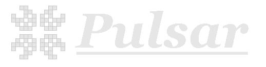
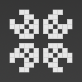

  

---
##  What is Pulsar?
Pulsar is a template based generator for bootstrapping addon creation.

---
## Why should I use Pulsar over other bedrock templating options?
Pulsar uses a no code, write once, bulk generation method of templating.
Just give it a list of names and Pulsar will take care of the rest.

---
## User templates
There are 2 different ways to use user templates. 
You can either make a custom one inside of User_templates/custom or you can put a .pulsar file inside of User_templates/imported

### What are user templates?
User templates are Pulsar's dynamic template system designed to allow anyone to make their own template without having to know how to code.

### How do I make a custom user template?
Just place normal addon json inside of the correct folders with the name of your template. To activate the templating features just replace all the old item names with $name and pulsar will take care of the rest.

### How do I make a .pulsar file?
Just add the template structure starting from the template type (Block | Entity | Item) into a zip with the name of your template.
then just rename the .zip to .pulsar.

---
## Have more questions?
Join our discord: https://discord.gg/Qw3dgW7Uay